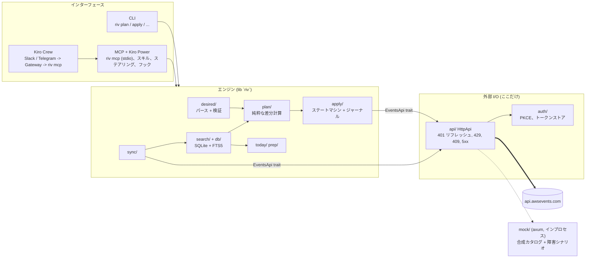
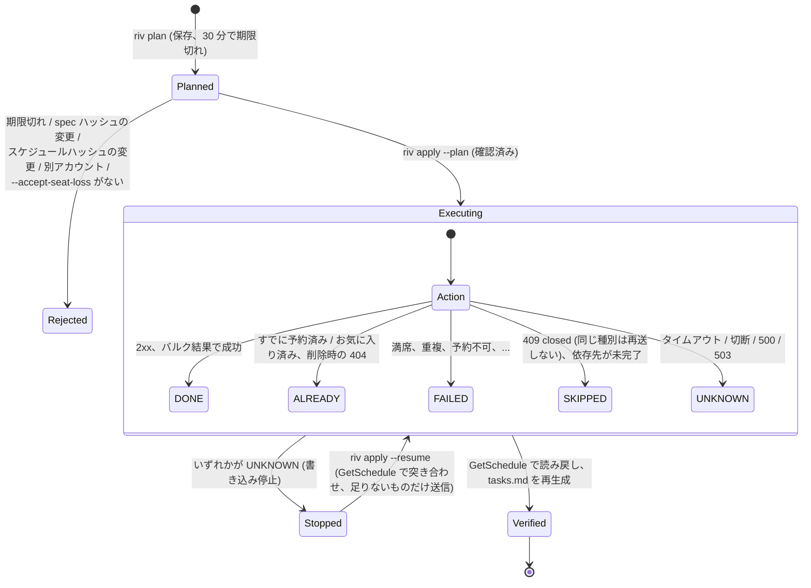

# アーキテクチャ

## 1 つのエンジン、3 つのインターフェース

ロジックは lib が持ち、`main.rs`、`mcp/`、`mock/` は薄いエントリポイントです。ネットワークと通信するものはすべて `EventsApi` トレイト（`api/`）と `auth/` を経由するため、テストでは空きポート上の mock サーバーに差し替えられます。plan / apply の判断は、単純なデータに対する同期的な純粋関数（`plan::build_plan`、`apply::verify`）であり、非同期なのは I/O の境界だけです。

## 各ルールの所在（単一の情報源）

| 知識 | 場所 |
|---|---|
| REST オペレーション（メソッド + パス） | `src/api/ops.rs`。`tests/openapi_conformance.rs` が `openapi/awsevents.v1.json` と照合します |
| 分あたりのクォータ | `src/api/quota.rs` |
| UTC / ローカル / ワイヤー形式の時刻フォーマット | `src/timeutil.rs` |
| 望ましい状態（desired state）のセマンティクス | `src/plan/build.rs`。`tests/plan_semantics.rs` で固定されています |
| apply のセマンティクス | `src/apply/exec.rs`。`tests/apply_dod.rs` で固定されています |
| ユーザーに表示する文言 | `src/i18n/`（英語の文言がキーです） |

## plan / apply ステートマシン

置き換えは `cancel` の後に `reserve` を行うものです（reserve は cancel に `dependsOn` します）。cancel が成功した後で reserve が失敗した場合、riv は元の席を 1 回だけ予約し直そうとし、「restored」または「seat lost」を報告します。ただし、席の復元は決して保証されません。

## データ

SQLite（`~/.local/share/riv/riv.db`）: `events`、`sessions`（+ 生の JSON とハッシュ）、`sessions_fts`、`sync_runs`、およびジャーナルとして `runs`、`run_actions`、`managed`、`block_ids`、`prep_notes`。Plan は `~/.local/share/riv/plans/` 内の JSON ファイルです。
