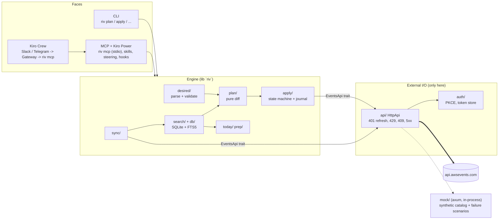
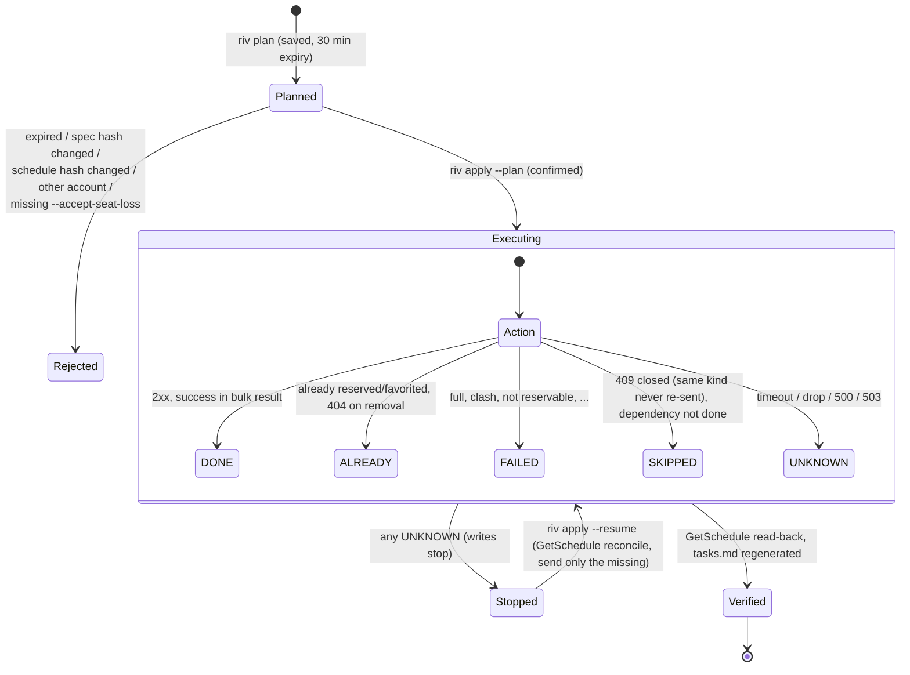

# Architecture

## One engine, three faces

The lib holds the logic; `main.rs`, `mcp/` and `mock/` are thin entry points. Everything that talks to the network goes through the `EventsApi` trait (`api/`) and `auth/`, so tests swap in the mock server on a free port. plan/apply decisions are synchronous pure functions over plain data (`plan::build_plan`, `apply::verify`); only the I/O edges are async.

## Where each rule lives (single source)

| Knowledge | Location |
|---|---|
| REST operations (method + path) | `src/api/ops.rs`, checked against `openapi/awsevents.v1.json` by `tests/openapi_conformance.rs` |
| Per-minute quotas | `src/api/quota.rs` |
| UTC / local / wire time formats | `src/timeutil.rs` |
| Desired-state semantics | `src/plan/build.rs`, fixed by `tests/plan_semantics.rs` |
| Apply semantics | `src/apply/exec.rs`, fixed by `tests/apply_dod.rs` |
| Words shown to users | `src/i18n/` (English text is the key) |

## plan / apply state machine

A replacement is `cancel` then `reserve` (the reserve `dependsOn` the cancel). If the reserve fails after the cancel succeeded, riv tries to reserve the original once and reports "restored" or "seat lost" — never promised.

## Data

SQLite (`~/.local/share/riv/riv.db`): `events`, `sessions` (+ raw JSON and hash), `sessions_fts`, `sync_runs`, and the journal: `runs`, `run_actions`, `managed`, `block_ids`, `prep_notes`. Plans are JSON files in `~/.local/share/riv/plans/`.
